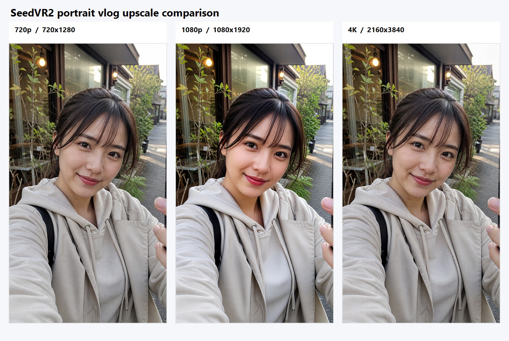

# MiniMax-H3 Experiment: Vertical Selfie Vlog / 720p, 1080p, and 4K Upscaling

> 日本語版: [README.ja.md](./README.ja.md)

- ID: `seedvr2-portrait-vlog-720p-1080p-4k`
- Date: `2026-08-10` (JST)
- Category: `07-upscaling`
- Status: `verified`
- GPU: NVIDIA GeForce RTX 4090 (24,564 MiB)
- Continuation of: [SeedVR2 RTX 4090 FHD / 4K video experiment](../seedvr2-4k-rtx4090/README.md)

The canonical record is [`experiment.json`](./experiment.json). The detailed report is [`REPORT.md`](./REPORT.md); the tracked visual proof is [`previews/contact-sheet.jpg`](./previews/contact-sheet.jpg) with [`previews/contact-sheet.json`](./previews/contact-sheet.json).

## X video and reference URL

- Generated image comparison: Not published / local-only (image-only continuation)
- Previous SeedVR2 result thread: <https://x.com/hAru_mAki_ch/status/2086601484901495018>
- Previous reference post: <https://x.com/aihonobono2023/status/2086281213334213104?s=46>
- SeedVR2 official distribution: <https://huggingface.co/Comfy-Org/SeedVR2>
- Workflow/run mapping: local-only; see [`workflows/`](./workflows/) and [`runs/`](./runs/)

## Comparison design

Image Gen produced one fictional adult selfie-vlog frame. It was center-cropped and Lanczos-resized to a common 9:16 720×1280 baseline. That exact PNG was reused as the input for both SeedVR2 runs.

| Label | Resolution | Role |
|---|---:|---|
| 720p | 720×1280 | Image Gen source converted to the common baseline |
| 1080p | 1080×1920 | Common 720p input → SeedVR2 |
| 4K | 2160×3840 | Common 720p input → SeedVR2 |

## Result

| Run | Result | Wall time | Peak VRAM | Output |
|---|---|---:|---:|---|
| 720p baseline | success | 5.114 s | 841 MiB | 720×1280 |
| 1080p | success | 30.112 s | 6,843 MiB | 1080×1920 |
| 4K | success | 15.116 s | 8,651 MiB | 2160×3840 |

The single-image 4K run completed under 9 GiB in the recorded RTX 4090 trace, so the temporal segmentation workaround from the preceding video experiment was not needed.

## Experiment kit

- Canonical record: [`experiment.json`](./experiment.json)
- Report: [`REPORT.md`](./REPORT.md)
- Sources and Image Gen prompt: [`sources.md`](./sources.md) / [`sources.ja.md`](./sources.ja.md)
- Workflows: [`workflows/`](./workflows/)
- Image runner: [`run-seedvr2-image-api.ps1`](./run-seedvr2-image-api.ps1)
- Raw run logs: [`runs/`](./runs/)
- Tracked visual proof: [`previews/contact-sheet.jpg`](./previews/contact-sheet.jpg)

The generated source, three PNG outputs, and model weights remain local-only. The clone-safe evidence is the tracked contact sheet, manifest, JSON record, workflows, runner, and raw logs.

## Limitations

- The 720p baseline is a center-cropped Lanczos conversion from a 1024×1536 Image Gen asset, not a native 720×1280 camera frame.
- The 1080p and 4K runs use the same SeedVR2 settings but different seeds (`2026081002` / `2026081003`).
- No quantitative perceptual, identity, or local-detail score was computed.
