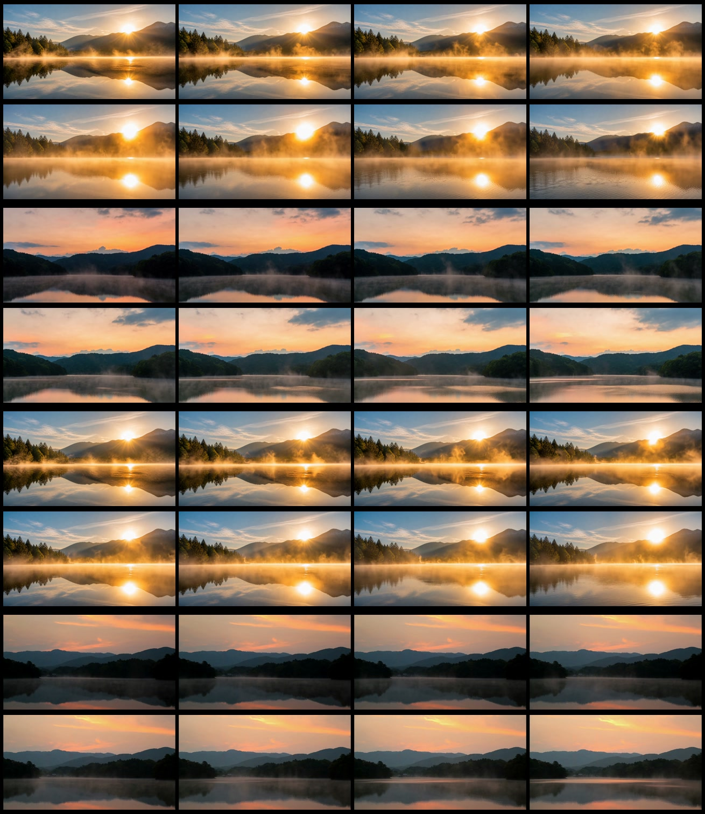
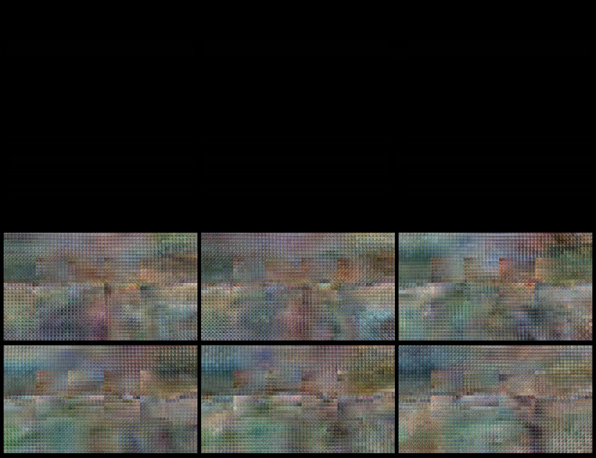
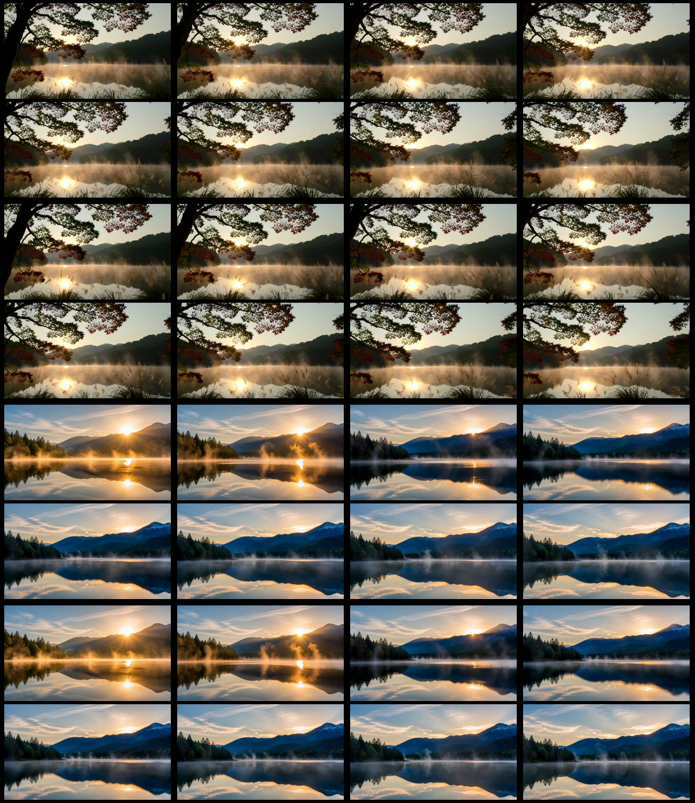
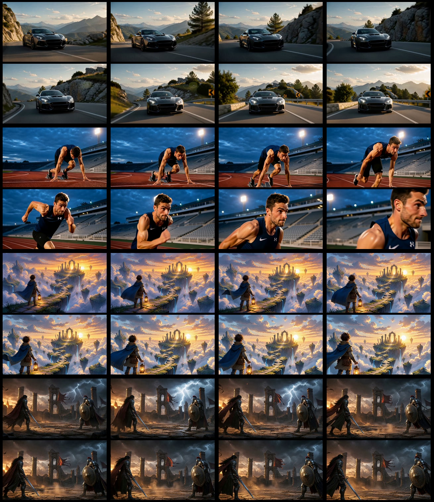
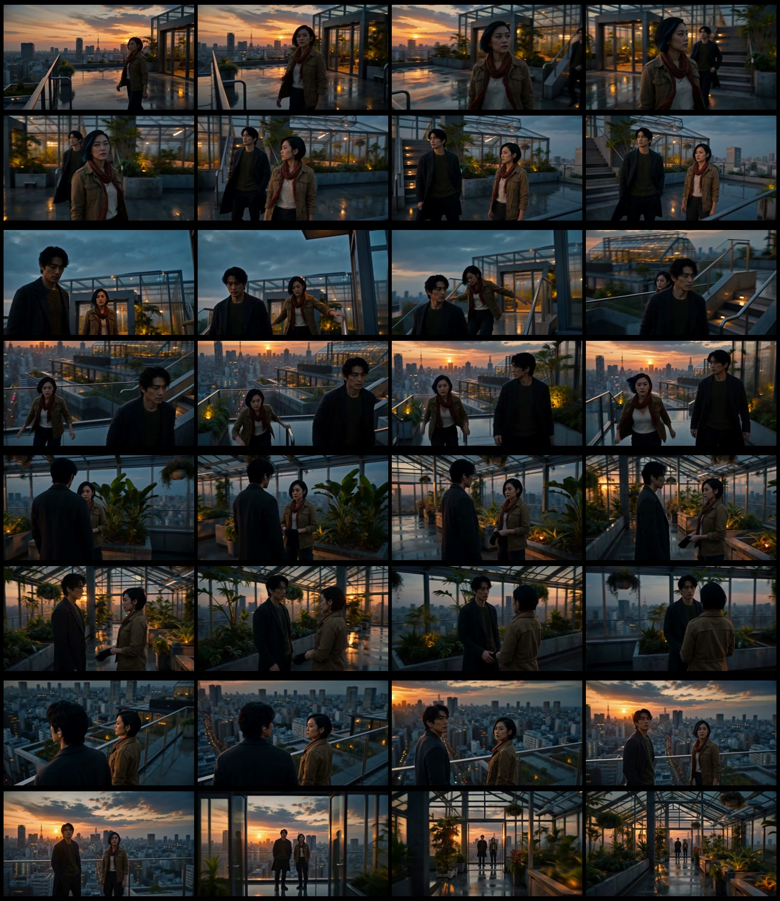
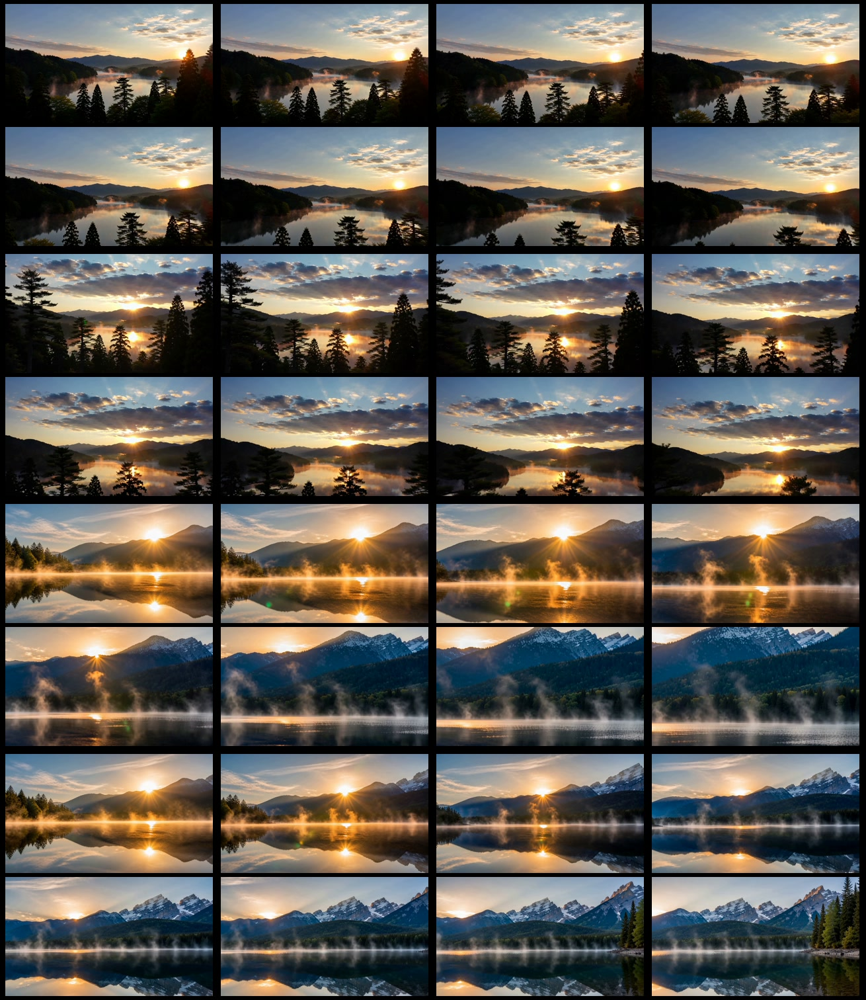
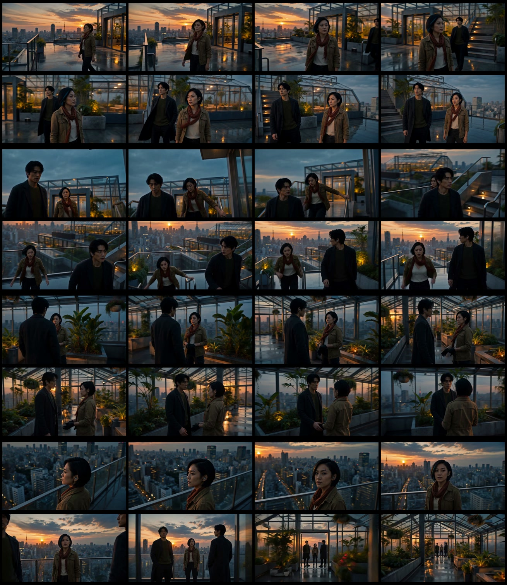
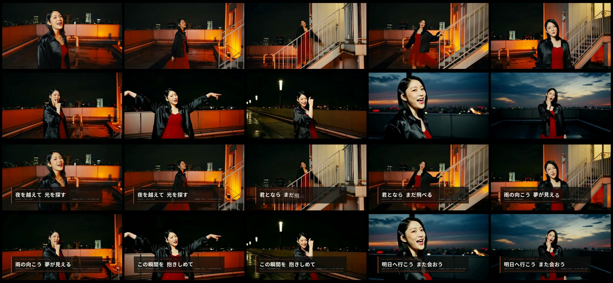

# MiniMax-H3 Experiments — visual index / 実験ギャラリー

This page is the visual front door for the experiment records. Each card links to the human-readable report, machine-readable JSON, tracked frame tile, and tile manifest.

このページは実験記録の視覚的な入口です。各実験について、README・`experiment.json`・Git追跡済みのフレームタイル・manifestへ直接移動できます。

> Public evidence policy: the frame tile and manifest are tracked in Git. Source MP4s under `runtime/*/output` or experiment `outputs` are local-only capture artifacts unless a page explicitly says otherwise; their hashes and media properties remain in the record.

## Visual catalog / ビジュアル一覧

| Function / 機能 | Frame tile / タイル | Key conditions / 主な条件 | Record / 記録 |
|---|---|---|---|
| GPU baseline / 基準比較 |  | RTX 3060 / 4090, T2V + I2V, 864×480–1280×704 | [README](./01-baseline/gpu-baseline/README.md) · [JSON](./01-baseline/gpu-baseline/experiment.json) · [manifest](./01-baseline/gpu-baseline/previews/contact-sheet.json) |
| 3060 black-output failure / 3060黒画失敗 |  | Legacy Turbo/full-int8 + int8 VAE, failed route retained as evidence | [README](./01-baseline/3060-black-output/README.md) · [JSON](./01-baseline/3060-black-output/experiment.json) · [manifest](./01-baseline/3060-black-output/previews/contact-sheet.json) |
| Low-step generation / 低ステップ生成 |  | LightX2V LoRA, 4 steps, T2V/I2V, 1344×768 | [README](./02-low-step-generation/lightx2v-4step/README.md) · [JSON](./02-low-step-generation/lightx2v-4step/experiment.json) · [manifest](./02-low-step-generation/lightx2v-4step/previews/contact-sheet.json) |
| ImageGen-started I2V / ImageGen開始I2V |  | Car, sports, illustration, battle; 4-step I2V, 1344×768 | [README](./03-reference-conditioned/i2v-scenes/README.md) · [JSON](./03-reference-conditioned/i2v-scenes/experiment.json) · [manifest](./03-reference-conditioned/i2v-scenes/previews/contact-sheet.json) |
| Multi-reference R2V / 複数リファレンスR2V |  | Background + 2 characters, 4 scenes, about 7 seconds | [README](./03-reference-conditioned/multi-reference-r2v-4scenes-7s/README.md) · [JSON](./03-reference-conditioned/multi-reference-r2v-4scenes-7s/experiment.json) · [manifest](./03-reference-conditioned/multi-reference-r2v-4scenes-7s/previews/contact-sheet.json) |
| ref2va 6 vs 20 steps / ref2va比較 |  | T2V/I2V, LoRA 0.8, `er_sde`, 6 vs 20 steps | [README](./03-reference-conditioned/ref2va-6v20/README.md) · [JSON](./03-reference-conditioned/ref2va-6v20/experiment.json) · [manifest](./03-reference-conditioned/ref2va-6v20/previews/contact-sheet.json) |
| Attention/cache acceleration / 高速化 |  | Sol-Attn + generic CUDA SageAttention + EasyCache, 2.092× average | [README](./04-acceleration/sol-sage-easycache-4scenes-7s/README.md) · [JSON](./04-acceleration/sol-sage-easycache-4scenes-7s/experiment.json) · [manifest](./04-acceleration/sol-sage-easycache-4scenes-7s/previews/contact-sheet.json) |
| Motion Context / 時間連続性 |  | 3-segment video/audio latent carry-over, 1280×704 | [README](./05-temporal-continuity/motion-context-3segment/README.md) · [JSON](./05-temporal-continuity/motion-context-3segment/experiment.json) · [manifest](./05-temporal-continuity/motion-context-3segment/previews/contact-sheet.json) |
| Japanese cat-café Vlog / 日本語猫カフェVlog |  | 5 segments, Japanese dialogue, about 30 seconds | [README](./06-production-pipelines/catcafe-vlog-5segment/README.md) · [JSON](./06-production-pipelines/catcafe-vlog-5segment/experiment.json) · [manifest](./06-production-pipelines/catcafe-vlog-5segment/previews/contact-sheet.json) |
| Japanese synth-pop MV / 日本語シンセポップMV |  | 5 segments, generated audio, lyric motion, about 30 seconds | [README](./06-production-pipelines/jpop-mv-5segment/README.md) · [JSON](./06-production-pipelines/jpop-mv-5segment/experiment.json) · [manifest](./06-production-pipelines/jpop-mv-5segment/previews/contact-sheet.json) |

## How to read a record / 実験記録の読み方

1. Start with the **README** for the hypothesis, conclusion, conditions, timings, prompts, and limitations.
2. Open the **frame tile** to understand temporal behavior without downloading a full video.
3. Open `experiment.json` for structured parameters, run IDs, hashes, and output paths.
4. Open `previews/contact-sheet.json` to see the exact source video path, sample timestamps, dimensions, duration, and SHA-256 used to make the tile.
5. Treat `runtime/*/output` and experiment `outputs` MP4 paths as local capture locations unless the record explicitly marks them as tracked. A fresh clone is expected to contain the tile, not every generated video.

## Other indexes / 追加の入口

- [Full machine-readable ledger / 完全な実験台帳](./index.md)
- [Experiment schema / スキーマ](./experiment.schema.json)
- [New experiment template / 新規実験テンプレート](./_template/README.md)
- [Docker and reproducibility contract / Docker・再現性ガイド](../LAB.md)
- [X payload and simulator index / X投稿・シミュレーター台帳](../social/README.md)
